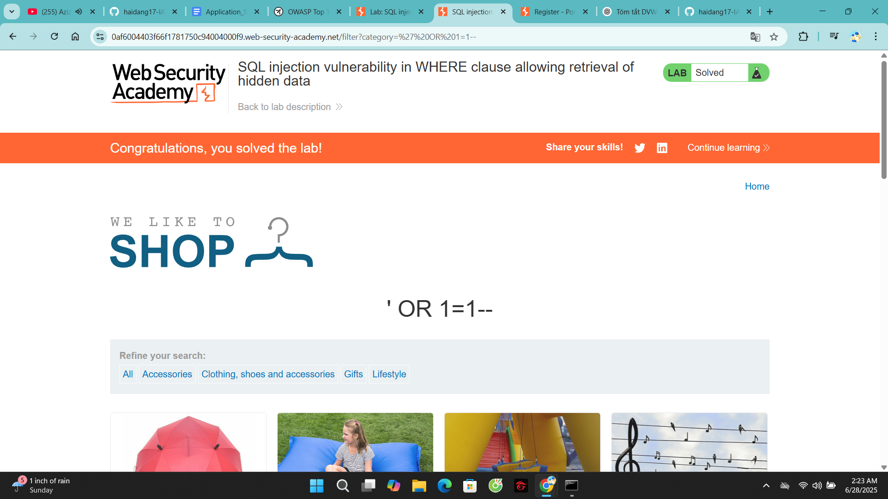

# Lab: SQL injection vulnerability in WHERE clause allowing retrieval of hidden data

**Lab Link:** [https://portswigger.net/web-security/sql-injection/lab-retrieve-hidden-data](https://portswigger.net/web-security/sql-injection/lab-retrieve-hidden-data)

## Explanation

Imagine a shopping application that displays products in different categories. When the user clicks on the `Gifts` category, their browser requests the URL:

`https://insecure-website.com/products?category=Gifts`

This causes the application to make a SQL query to retrieve details of the relevant products from the database:

```sql
SELECT * FROM products WHERE category = 'Gifts' AND released = 1
This SQL query asks the database to return:

all details (*)

from the products table

where the category is Gifts

and released is 1.

The restriction released = 1 is being used to hide products that are not released. We could assume for unreleased products, released = 0.

The application doesn't implement any defenses against SQL injection attacks. This means an attacker can construct the following attack, for example:

https://insecure-website.com/products?category=Gifts'--
This results in the SQL query:

SELECT * FROM products WHERE category = 'Gifts'--' AND released = 1

Crucially, note that -- is a comment indicator in SQL. This means that the rest of the query is interpreted as a comment, effectively removing it. In this example, this means the query no longer includes AND released = 1. As a result, all products are displayed, including those that are not yet released.

You can use a similar attack to cause the application to display all the products in any category, including categories that they don't know about:

https://insecure-website.com/products?category=Gifts'+OR+1=1--

This results in the SQL query:

SELECT * FROM products WHERE category = 'Gifts' OR 1=1--' AND released = 1
The modified query returns all items where either the category is Gifts, or 1 is equal to 1. As 1=1 is always true, the query returns all items.

