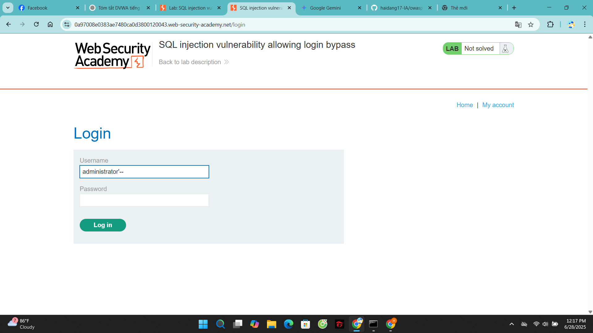
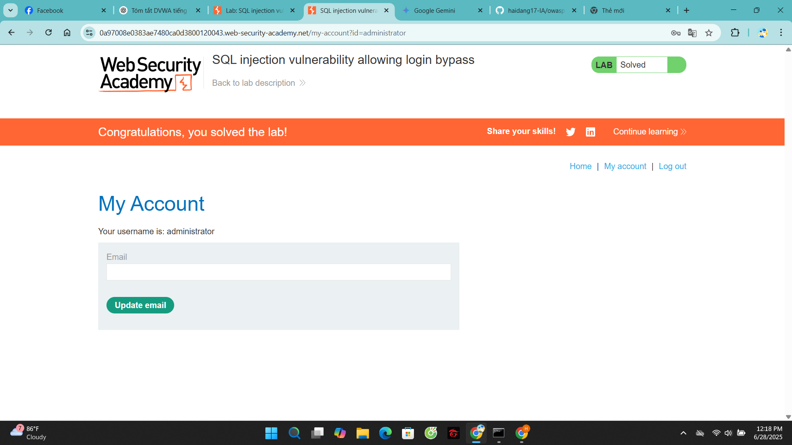

# Lab: SQL injection vulnerability allowing login bypass

**Lab Link:** [https://portswigger.net/web-security/sql-injection/lab-login-bypass](https://portswigger.net/web-security/sql-injection/lab-login-bypass)

## Explanation

Imagine an application that lets users log in with a username and password. If a user submits the username `abc` and the password `abc`, the application checks the credentials by performing the following SQL query:

```sql
SELECT * FROM users WHERE username = 'abc' AND password = 'abc'
If the query returns the details of a user, then the login is successful. Otherwise, it is rejected.

In this case, you can log in as any user without the need for a password. They can do this using the SQL comment sequence -- to remove the password check from the WHERE clause of the query. For example, submitting the username administrator'-- and a blank password results in the following query:

SQL

SELECT * FROM users WHERE username = 'administrator'--' AND password = ''

This query returns the user whose username is administrator and successfully logs the attacker in as that user.

